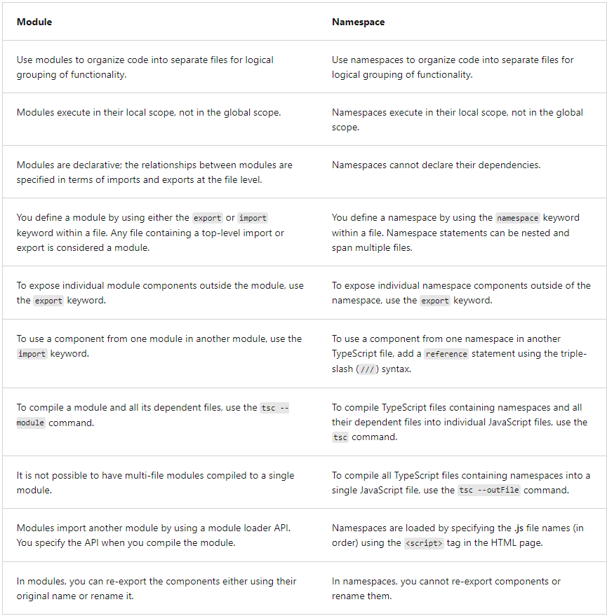

# Table of Contents
1. [Lesson 1 Equality](#lesson-1-equality)
2. [Lesson 2 Interfaces](#lesson-2-interfaces)
3. [Lesson 3 Functions](#lesson-3-functions)
4. [Lesson 4 Classes](#lesson-4-classes)
5. [Lesson 5 Generics](#lesson-5-generics)
6. [Lesson 6 Modules & External libraries](#lesson-6-modules--external-libraries)
7. [Lesson 7 Namespaces](#lesson-7-namespaces)
8. [Lesson 8 Extra features](#lesson-8-extra-features)
9. [Lesson 8 Project](#lesson-9-project)


**Useful links**

- [TypeScript Handbook](https://www.typescriptlang.org/docs/handbook/intro.html)  
- [TypeScript GitBook](https://basarat.gitbook.io/typescript)  
- [DefinitelyTyped: JS libraries TS definitions](https://definitelytyped.github.io/))


# Lesson 1. Equality

- strict equality (===): no type conversion + ```NaN != NaN``` + ```+0==-0```
- loose equality (==): type conversion + ```NaN != NaN``` + ```+0==-0```
- Object.is: no type conversion + no special handling for ```Nan, +0, -0```

# Lesson 1. Variable types 

## Variable declarations 
**let** - new variable in a scope {},
**var** - new variable in a function scope,
**const** - new constant, can't be re-assigned. 

if a type is specified, a value of another type can't be assigned. 
```typescript
let x: number = 10;
```

## Types 


- *null* & *undefined*
  - null is absence of value, undefined means that value is not initialized. 
  - null and undefined can't be used to declare variables only referenced by using literals 
  - null and undefined are subtypes of all types, so literals of it can be assigned to any variable.
-  any* & *unknown*
  - any allows you to assign any  without compilation exceptions (flexible but comes at cost of potential runtime exceptions)
  - unknown is similar to any but with compile-checking
- *number*
  - number = float + 
  - bigint
  - literals = hexadecimal, decimal and binary. 
- *string*
  - UTF-16
  - "" = ''
  - template strings = several lines + placeholders: `... ${placeholder}...\n....`
- *enum*: value by index of an array / number by a direct reference to a value
    ```typescript
    enum ContractStatus {
         Permanent = 5,
         Temp,
         Apprentice
    }
    
    let employStatus: ContractStatus = ContractStatus.Permanent;
    
    console.log(ContractStatus[employStatus]); // Permanent
    console.log(employStatus) // 5
    ```

**Type assertion** is the same as cast in Java: you are telling the compiler to use the variable with a particular type.  
**Type guards** - checking type: *typeof*  
```typescript
(variable as type).merhod();  // preferrabe
(<type>variable).method();

if(typeof variable === "string") {}
```  

## Union, intersection and literal types

*Union* - limiting the number of possible types (declare several possible types)  
*Intersection* - combining attributes of several types (usually with interfaces, like implementing several ones)

When we use *var* | *let* we declare a type but values can be changed, however we can bind a particular literal type by using *const*. 
In that case, literal type is assigned, and it is called *narrowing* (to narrow possible literals to assign). 
Narrowing can be to one literal or to a list of them. 

```typescript
let variable: null | boolean;  // union

const a = "string";    // narowwing to a concrete literal type
const b = "string" | "not string"   // narrowing to two literal types 

b = "string"   // valid
b = "number"  // invalid
```

## Array & tuple
*Array* - values of the same type,    
*Tuple* - values of different type;
```typescript
let array1: number[] = [1,2,3];
let array2: Array<string> = ['a', 'b', 'c'];
let tuple: [string, number] = ["Igor", 28];
```

# Lesson 2. Interfaces 

Generally, the way how an object can be described in TS.

- interface is a contract, which describe a type (data structure) but can't be instantiated itself,
- benefits: shorthand names for common types, consistency over types in use,
- interfaces are deleted (as well as types) when compiling to JS
- type alias is pretty similar to an interface (subtle difference: type alias can't be changed)

**Attributes**
- required (default)
- optional (```name?: type;```)
- read only - can be assigned only while initialisation (```readonly name: type;```)

```typescript

interface IceCream {
  flavour: string;
  scoops: number;
  instuctions?: string;
}

let plombire: IceCream = {
  flavour: "oil",
  scoops: 2
}

function tooManyScoops(icecream: IceCream) {
  if (icecream.scoops > 4) {
    return icecream.scoops + "is too many scoops";
  } else {
    return "Your order will be ready soon!"
  }
}

console.log(tooManyScoops({flavour: "vanilla", scoops: 5}));

// usage 1 indexed array structures
interface IceCreamArray {
  [index: number]: string;
}

let myIceCream: IceCreamArray;
myIceCream = ['chocolate', 'vanilla', 'strawberry'];
let myStr: string = myIceCream[0];

// usage 2 wrapper over the usage of JS API

interface Post {    // wrapper
  userId: number;
  id: number;
  title: string;
  body: string;
}
async function fetchPosts(url: string) {
  let response = await fetch(url);  // JS API function - fetch
  let body = await response.json(); 
  return body as Post[];  // convert json -> Post
}

```

## Structural type system

- only types are taken into account
- interfaces with members of the same type are interchangeable 
- functions: 
  - input parameters and return type are considered
  - trick: it's possible to assign the function with more input | output parameters to the function with fewer numbers of them but not vice versa
```typescript

interface Ball {
  diameter: number;
}
interface Sphere {
  diameter: number;
}

let ball: Ball = { diameter: 10 };
let sphere: Sphere = { diameter: 20 };

// interchangeability of two interfaces with the same types
sphere = ball; 
ball = sphere;

interface Tube {
  diameter: number;
  length: number;
}

let tube: Tube = { diameter: 12, length: 3 };

// interface with less members can be assigned to the interface with more members but not vice versa
tube = ball; // comperr
ball = tube;

// functions

let createBall = (diameter: number) => ({ diameter });
let createSphere = (diameter: number, useInches: boolean) => {
  return { diameter: useInches ? diameter * 0.39 : diameter };
};
let createRedBall = (diameter: number) => ({ diameter, color: "red" });

// function with less input parameters can be assigned to the function with more paramters but not vice versa
createSphere = createBall;
createBall = createSphere;  // comperr
// the same for output parameters 
createBall = createRedBall;
createRedBall = createBall; // comperr

```

# Lesson 3. Functions

Generally, the way how an object can be described in TS.

- TypeScript supports typing input parameters and a return type of function whereas JS doesn't support this,
- TypeScript support required and optional parameters whereas in JS all parameters are optional,

## How to declare function

1. Named functions: 
   - defined in a scope, 
   - loaded into execution before any code runs
   - can be accessed before its declaration
2. Anonymous functions 
   - usually assigned to a variable or passed to another function 
   - loaded into execution when called 
   - can be accessed only after its declaration
3. Arrow functions (lambda)
   - the same as anonymous functions but with concise syntax (like in Java: short operations, implicit return)
   - "=>"

```typescript
// named
function addNumbers (x: number, y: number): number {   // return type can be omitted if a function doesn't return anything
  return x + y;
}
addNumbers(1, 2);

//anonymous
let addNumbersVar1 = function (x: number, y: number): number {
  return x + y;
}
// arrow function
let addNumbersVar2 = (x: number, y: number): number => x + y;

addNumbersVar1(1, 2);
```

## Input parameters

- JS: all parameters are optional, TypeScript: by default, all parameters are required
- Optional parameters ```x?``` or provided with a default value ```x=25```
- varargs is supported (rest parameters): ```...others: number[]``` -> array of numbers
- named parameters - through deconstructed object parameters (using interface)
```typescript
interface Message {
   text: string;
   sender: string;
}

function displayMessage({text, sender}: Message) {
    console.log(`Message from ${sender}: ${text}`);
}

displayMessage({sender: 'Christopher', text: 'hello, world'});
```

## Function types

- function type can be declared as typing alias or interface,
- we can use function as a type of variable: ```let variable: function``` ,
- when a function is a return type, you can pass values to it in the same statement,
- declaring a function implementation, it's possible to omit data types as they can be referred from the function reference
```typescript
// the same
type calculator = (x: number, y: number) => number;

interface calculator {
    (x: number, y: number): number;
}

// implementations
let addNumbers: calculator = (x: number, y: number): number => x + y;
let subtractNumbers: calculator = (x, y) => x - y;  // omitting data types

// returning a function and calling the result

let doCalculation = (operation: 'add' | 'subtract'): calculator => {
    if (operation === 'add') {
        return addNumbers;
    } else {
        return subtractNumbers;
    }
}

console.log(doCalculation('add')(1, 2))  // doCalculation returns a function which is respectevely called with the parameters (1,2)

```

# Lesson 4. Classes

Generally, the way how an object can be described in TS.

- class can have *constructor* (**only one**), *properties*, *methods*,
- *access modifiers* are enabled (default - *public*): public, private, protected, readonly,
- *accessors* (get/set) are enabled
- when comparing types, they have to have the same private and protected members.
- *inheritance* and *method overriding* are available 

```typescript

interface Vehicle {
    make: string;
    color: string;
    doors: number;
    accelerate(speed: number): string;
    brake(): string;
    turn(direction: 'left' | 'right'): string;
}

class Car implements Vehicle{
    
  private static numberofCars: number = 0;
  private make: string;  // properties
  private color: string;
  doors: number;
  
  // constructor with the optional parameter with a default value
  constructor(make: string, color: string, doors = 4) {  
    this.make = make;
    this.color = color;
    this.doors = doors;
    Car.numberofCars++;
  }

  // getters and setters 
  get getMake() {
    return this.make;
  }
  set setMake(make:string) {
    this.make = make;
  }

  get getColor() {
    return 'The color of the car is ' + this.color;
  }
  set setColor(color: string) {
    this.color = color;
  }

  get getDoors() {
    return this.doors;
  }
  set setDoors(doors: number) {
    if ((doors % 2) === 0) {
        this.doors = doors;
    } else {
        throw new Error('Doors must be an even number');
    }
  }

  // Methods
  accelerate(speed: number): string {
    return `${this.worker()} is accelerating to ${speed} MPH.`
  }
  brake(): string {
    return `${this.worker()} is braking with the standard braking system.`
  }
  turn(direction: 'left' | 'right'): string {
    return `${this.worker()} is turning ${direction}`;
  } 
  // This function performs work for the other method functions
  protected worker(): string {
    return this.make;
  }
}

class ElectricCar extends Car {

    private _range: number;

    // Constructor: required parameters -> optional -> rest
    constructor(make: string, color: string, range: number, doors = 2) {
        super(make, color, doors);
        this._range = range;
    }

    // Methods
    charge() {
        console.log(this.worker() + " is charging.") // calling the protected member of the superclass 
    }

    // Overrides the brake method of the Car class
    brake(): string {
        return `${this.worker()}  is braking with the regenerative braking system.`
    }

}

// Instantiates the Car object with all parameters
let myCar = new Car('Cool Car Company', 'blue', 3);
myCar.doors  // property get
myCar.doors = 5;  // property set
myCar.getDoors;   // using getter
myCar.setDoors = 5;   // using setter
```

# Lesson 5. Generics

- replacement of type ```any``` which doesn't guarantee a type-safe,
- one or more generic types are possible,
- if a type is missed when initializing, it's possible to infer it for simple types or ```any``` is used, 


```typescript
/////////// function
function identity<T, U> (value: T, message: U) : T {  // use generics for input parameters and a return type
    console.log(message);
    return value
}

let returnNumber = identity<number, string>(100, 'Hello!');
let returnString = identity<string, string>('100', 'Hola!');
let returnBoolean = identity<boolean, string>(true, 'Bonjour!');

returnNumber = returnNumber * 100;   // OK
returnString = returnString * 100;   // Error: Type 'number' not assignable to type 'string'
returnBoolean = returnBoolean * 100; // Error: Type 'number' not assignable to type 'boolean'

///////////// interface
interface ProcessIdentity1<T, U> {
    (value: T, message: U): T;
}

function processIdentity<T, U> (value: T, message: U) : T {  // implementations of ProcessIdentity1
    console.log(message);
    return value
}

interface ProcessIdentity2<T, U> {
    value: T;
    message: U;
    process(): T;
}

class processIdentity<X, Y> implements ProcessIdentity2<X, Y> { // implementation of ProcessIdentity2
    value: X;
    message: Y;
    constructor(val: X, msg: Y) {
        this.value = val;
        this.message = msg;
    }
    process() : X {
        console.log(this.message);
        return this.value
    }
}

///////////// class
class processIdentity<T, U> {
    private _value: T;
    private _message: U;
    constructor(value: T, message: U) {
        this._value = value;
        this._message = message;
    }
    getIdentity() : T {
        console.log(this._message);
        return this._value
    }
}
let processor = new processIdentity<number, string>(100, 'Hello');
processor.getIdentity();      // Displays 'Hello'

```

- generic type allows to use only general methods, to use specific methods -> ```typeof``` (primitives) | ```instanceof``` (complex types)
- generic type constraints:
  - extend complex type: ```T extends Object```
  - primitives: list available types in a tuple and then extend it
  - extend ```keyof``` of another type: ```T extends keyof Type```
```typescript
// tuple
type ValidTypes = string | number;

function identity<T extends ValidTypes, U> (value: T, message: U) : T {  // T can bt only string | number
    let result: T = value + value;    // Error
    console.log(message);
    return result
}
// keyot
function getPets<T, K extends keyof T>(pet: T, key: K) {  // K may be only from the keys of T
    return pet[key];
}
```

# Lesson 6. Modules & external libraries 

TypeScript provides two ways to organize code: **namespaces** and **modules**. 
Starting with ECMAScript 2015, modules are native part of the language and are recommended for code organization.
Also, it is not recommended to combine namespaces and modules in the same project.

**Modules** is a way to organize and categorize code as well as limit its scope from global to module one. 

In TypeScript, just as in ECMAScript 2015, any file containing a top-level *import* or *export* is considered a *module*. 
Conversely, a file without any top-level import or export declarations is treated as a *script* whose contents are available in the global scope (and therefore to modules as well).

- *export* to make a block of code of your module public
- *import* to allow to use a public block of code in your program
- js files have to be imported to be executed in a browser
- modules are resolving by a *module loader*, which can be specified in a compiling command or tsconfig.json
```"module": "commonjs"```: Node.js -> CommonJS; require.js -> AMD, UMD, SystemJS; ECMAScript 2015 (ES6) -> module-loading systems.

```typescript
// export, file "greetings_module.ts"
export function returnGreeting (greeting: string) {
    console.log(`The message from Greetings_module is ${greeting}.`);
}

// import 
// single function in the module
import { returnGreeting } from './greetings_module.js';
returnGreeting('Hola!')
// all exported components in the module
import * as allGreetingFunctions from './greetings_module.js';
allGreetingFunctions.returnGreeting('Bonjour');
// with changing the name
import { returnGreeting as greetingFunction } from './greetings_module.js';
returnGreetingLength('Ciao!');  

```

## Import external libraries

- import libraries into the ts file ```import dotenv from 'dotenv';``` (in JS - ```required```)
- TS compiler may raise errors when you use JS libraries without type definitions but it's possible to install them separately using @types (for example from [DefinitelyTyped](https://definitelytyped.github.io/)) 
```
npm install --save-dev @types/<library-name>
example: npm install --save-dev @types/node @types/dotenv
```
- Type definitions can be installed as [devDependencies](https://docs.npmjs.com/specifying-dependencies-and-devdependencies-in-a-package-json-file) as they are only needed at design time

# Lesson 7. Namespaces

**Namespaces** (referred to as "internal modules" in earlier versions of TypeScript) are a TypeScript-specific way to organize and categorize your code, enabling you to group related code (variables, functions, interfaces, or classes) together. 

- code inside a namespace pulled from the global context (preventing a context pollution)
- avoiding naming conflicts (```namespace1.function()``` and ```namespace2.function()```)
- TS feature -> removed when compiling to JS
- namespaces can be nested (namespace of namespaces)
- use *export* to allow using namespace code outside of it, calling this code: ```namespace.function()```

```typescript

namespace GreetingsWithLength {
    export function returnGreeting (greeting: string) {   // public function
        let greetingLength = getLength(greeting);
        console.log(`The message from namespace GreetingsWithLength is ${greeting}. It is ${greetingLength} characters long.`);
    }
    function getLength(message: string): number {    // private function (scope = namespace)
        return message.length
    }
}

// calling the code in the namespace
returnGreeting('Hello');                     // Returns error
GreetingsWithLength.returnGreeting('Hola');  // OK

// namespace of namespaces
namespace AllGreetings {
    export namespace Greetings {     // public namespace
        export function returnGreeting (greeting: string) {    // public function
            console.log(`The message from namespace Greetings is ${greeting}.`);
        }
    }
    export namespace GreetingsWithLength {
        export function returnGreeting (greeting: string) {
            console.log(`The message from namespace GreetingsWithLength is ${greeting}. It is ${greetingLength} characters long.`);
        }
    }
}

// using aliases (for complex namespace structure)
import greet = AllGreetings.Greetings;
greet.returnGreeting('Bonjour');

```

## Multi-file namespaces

It's possible to combine several fine into one logical module. For this, it needs to add a reference: ```/// <reference path="file.ts"/>```. 

Compilation options:
- different files -> default option -> it needs to use ```<script>``` on the webpage to download all scripts in the right order. 
- one file -> option ```--outFile```: ```tsc --outFile main.js main.ts```




# Lesson 8. Extra features

### Arrow functions
- shorter syntax (no ```function```, no arguments)
- keep ```this```

```typescript
class Person {
    constructor(public age:number) {}
    growOld = () => {
        this.age++;
    }
}
var person = new Person(1);
setTimeout(person.growOld,1000);

setTimeout(function() { console.log(person.age); },2000); // 2
```

### Rest parameters

Like varargs

```typescript
function iTakeItAll(first, second, ...allOthers) {
    console.log(allOthers);
}
iTakeItAll('foo', 'bar'); // []
iTakeItAll('foo', 'bar', 'bas', 'qux'); // ['bas','qux']
```

### let / const / var

```var``` - defining a variable in a *functions* scope (or global)
```let``` - defining a variable in a *block* scope
```const``` - defining a immutable variable in a *block* scope

### Deconstructing 

Expression that makes it possible to unpack values from arrays, or properties from objects, into distinct variables.

```typescript
var rect = { x: 0, y: 10, width: 15, height: 20 };

var {x, y, width, height} = rect; // Destructuring assignment
console.log(x, y, width, height); // 0,10,15,20

rect.x = 10;
({x, y, width, height} = rect); // assign to existing variables using outer parentheses
console.log(x, y, width, height); // 10,10,15,20

// comparing

const obj = {"some property": "some value"}; // structure
const {"some property": someProperty} = obj;  // destructure
console.log(someProperty === "some value"); // true

// array destructing
var [x, y, ...remaining] = [1, 2, 3, 4];
console.log(x, y, remaining); // 1, 2, [3,4]
var [x, , ...remaining] = [1, 2, 3, 4];  // ignore one element
console.log(x, remaining); // 1, [3,4]

// swap elements
var x = 1, y = 2;
[x, y] = [y, x];
console.log(x, y); // 2,1


```

## Spread operator

Simple syntax for applying elements of an array | object to sequence of variables | parameters

```typescript
function foo(x, y, z) { }
var args = [0, 1, 2];
foo(...args);

var [x, y, ...remaining] = [1, 2, 3, 4];  // rest parameters - 1,2,[3,4]

var list = [1, 2];
list = [...list, 3, 4];   // array spreading  - 1,2,3,4

const point2D = {x: 1, y: 2};
const point3D = {...point2D, z: 3};
```

## for of

Solution to the JS caveat that in ```for x in array``` x - index
```typescript
for (var item in someArray) {
    console.log(item); // 0,1,2
}

for (var item of someArray) {
    console.log(item); // 9,2,5
}
```

## Iterators

Any implementation of the *Iterator interface*.  
It's recommended to use ```IterableIterator``` as it more convenient both for iterating and for getting the next element. 

```typescript
interface Iterator<T> {
    next(value?: any): IteratorResult<T>;
    return?(value?: any): IteratorResult<T>;
    throw?(e?: any): IteratorResult<T>;
}

interface IteratorResult<T> {
    done: boolean;
    value: T;
}
```

## Template strings

Put in `` instead of ordinary '' and "" and used for: 

- sting interpolation
- multiple-line strings
- tagged templates - a function that can be put before the template string and can preprocess this template and placeholders returning a result string.  

```typescript
// sting interpolation
var html = '<div>' + lyrics + '</div>';
var html = `<div>${lyrics}</div>`;  // with a template

// multiple lines 
var lyrics = "Never gonna give you up \
\nNever gonna let you down";
var lyrics = `Never gonna give you up
Never gonna let you down`;  // with a template

//tagged templates
var html = htmlEscape `<div> I would just like to say : ${say}</div>`;  // htmplEscape is a tag function
```

## Promise

Function = function for controlling whether using the *resolve* function or *reject* one + functions for resolving and rejecting. 

```typescript
const promise = new Promise((resolve, reject) => {
    // the resolve / reject functions control the fate of the promise
});

const promise1 = new Promise((resolve, reject) => {
    resolve(123);   // logic of controlling
});
promise1.then((res) => {   // what to do in case of resolving
    console.log('I get called:', res === 123); // I get called: true
});
promise1.catch((err) => {  // what to do in case of error
    // This is never called
});

```

## Generators
- syntax - ```function*```
- keyword ```yield``` to return values. 

Function that return lis of values. 

```typescript
function* idMaker(){
  let index = 0;
  while(index < 3)
    yield index++;
}

let gen = idMaker();

console.log(gen.next()); // { value: 0, done: false }
console.log(gen.next()); // { value: 1, done: false }
console.log(gen.next()); // { value: 2, done: false }
console.log(gen.next()); // { done: true }
```

## Async await

Ability to block async code on the promise resolution

```typescript
async function foo() {
    try {
        var val = await getMeAPromise();
        console.log(val);
    }
    catch(err) {
        console.log('Error: ', err.message);
    }
}
```

# Lesson 9. Project 

## Compilation context

Grouping of the files that TypeScript will parse and analyze to determine what is valid and what isn't. 

```tsconfig.json``` - compilation configurations. Empty file in the root directory includes all tsconfig.json files from all directories below.
- *compilerOptions*
- *include/exclude* - files and directories 
- *files* - list all needed files explicitly 

## Grouping code - modules and namespaces 

**Modules**
- state explicit *import* and *export* statements for dependencies and encapsulation. 
- module paths: 
  - relative path (according to path)
  - dynamic lookup (according to some rules): several default paths + how to find a required file
- global declaration (```declare module```) | using ```global.d.ts``` (declare all types and interfaces)

Look at [Lesson 6 Modules & External libraries](#lesson-6-modules--external-libraries)

**Namespaces**  
Look at [Lesson 7 Namespaces](#lesson-7-namespaces)

## Project checklist

1. Create directory,
2. Create a ```tsconfig.json```, root (compilation options and files)
3. Create a ```package.json```, root 
   Define the project ([source](https://docs.npmjs.com/cli/v7/configuring-npm/package-json))
   - name, 
   - version, 
   - license,
   - keywords - for the project,
   - homepage - url, 
   - files - entries to be included when your package is installed as a dependency,
   - main - entrypoint,
   - bin - install some executables to PATH,
   - man - file for the ```man``` (manual),
   - directories - indicate the structure of the project (package),
   - repositories - repo of the code, 
   - scripts - script commands that are run at various times in the lifecycle of your package,
   - config - set configuration parameters used in package scripts that persist across upgrades,
   - dependencies (git url, github url, local)
     - devDependencies - to exclude dependencies that are not essential in runtime
     - bundledDependencies - array of package names that will be bundled when publishing the package, 
     - optionalDependencies - build failures do not cause installation to fail
   - engines - restriction on engines you module is supposed to run on
   - os - restriction on operational systems you module is supposed to run on

4. Create a ```webpack.config.js``` to bundle your modules into a single app.js file that contains all your resources and can be easily processed by a browser. 
    - entry - define the entrypoint to start the bundle
    - output - where created file should be stored
    - loaders - extend functionality to process file of unsupported type to add them into your bundle (```module/rules```: test + use)
    - plugins - extend functionality to handle more tasks
    - mode - specify a particular configuration you have: development, production, or none. 
5. ```src/templates/index.html``` file (source ```index.html``` generated by the web-pack)
6. ```src/app/app.tsx``` - frontend application entry point

Example of the project structure:
```
package
├─ package.json
├─ tsconfig.json
├─ src
│  ├─ index.ts
│  ├─ foo.ts
│  └─ ...All your source files (Authored)
└─ lib
├─ index.d.ts.map
├─ index.d.ts
├─ index.js
├─ foo.d.ts.map
├─ foo.d.ts
├─ foo.js
└─ ... All your compiled files (Generated)
```


